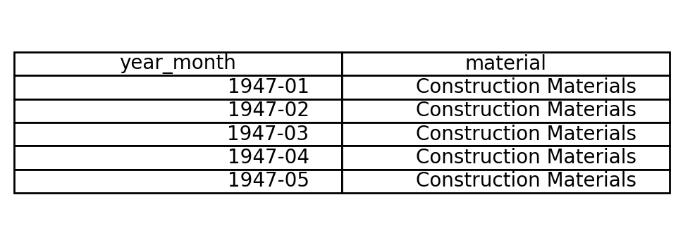
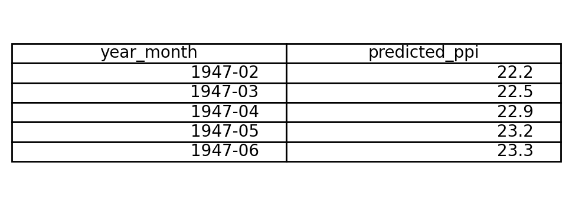

# construction-ppi-forecaster

## Problem/Goal 
Forecast PPI for core building materials (e.g., “Lumber”, “Iron & Steel”, “Construction Materials”) using BLS PPI data to anticipate cost movement.

## Inputs
Year-Month (YYYY-MM) and Material Type (e.g., Lumber, Iron & Steel, Construction Materials).

## Output
Predicted PPI index (1982=100).

## Data Source
FRED series WPUSI012011 (Construction Materials), plus WPU081 (Lumber) and WPU101 (Iron & Steel). Monthly, Jan 1947→Aug 2025; CSV download.

## Metric
MAE (in index points).

## Baseline Implementation (Milestone)
For this milestone, a **naïve baseline** model has been implemented:  
> The next month’s PPI equals the previous month’s observed PPI.  

The baseline uses the **Construction Materials (WPUSI012011)** dataset only.  
Additional materials (Lumber and Iron & Steel) will be added in later stages.

---

## Input / Output Examples
The figures below show the first few data points from the input and predicted output used in the baseline:

**Input Example:**  


**Output Example:**  


---

## Final Dataset and Features (Final Milestone)

For the final project milestone, the dataset was extended to cover **three materials**:

- Construction Materials – `WPUSI012011`
- Iron & Steel – `WPU101`
- Lumber – `WPU081`

All series are monthly PPI indices (1982 = 100) loaded from FRED and combined into a single long-format table with:

- `date` – monthly timestamp  
- `material` – one of {Construction Materials, Iron & Steel, Lumber}  
- `ppi` – observed PPI value  
- `year` – calendar year (numeric)  
- `month` – calendar month (1–12)  

To capture time-series structure, the following lag and trend features were added:

- `ppi_last_month` – PPI value one month earlier (lag-1)  
- `ppi_last_year` – PPI value 12 months earlier (lag-12)  
- `rolling_12` – 12-month rolling mean of PPI  

Rows where lag/rolling values are not available (first ~12 months per material) are dropped before modeling.

---

## Final Baselines (All Materials)

The two baselines are:

1. **Naïve (last value) baseline**  
   - Predict next month’s PPI as the **last observed** PPI.  
   - Uses `ppi_last_month` directly as the forecast.

2. **12-month rolling mean baseline**  
   - Predict next month’s PPI as the **12-month rolling average** (`rolling_12`).

These are evaluated separately for each material using **MAE** on the last 20% of months (chronological split).

Approximate test MAE (in index points):

- **Construction Materials**
  - Naïve: ~0.72  
  - Rolling 12-month: ~2.46  

- **Iron & Steel**
  - Naïve: ~1.53  
  - Rolling 12-month: ~5.01  

- **Lumber**
  - Naïve: ~2.31  
  - Rolling 12-month: ~5.29  

The naïve baseline is surprisingly strong for all three materials and serves as a lower-bound reference.

---

## Main Models (Final Milestone)

Two simple supervised models were trained per material using the engineered features:

### 1. Linear Regression

- Features:
  - `year`, `month`
  - `ppi_last_month`
  - `ppi_last_year`
  - `rolling_12`
- Pipeline:
  - `StandardScaler` → `LinearRegression` (scikit-learn)
- Train/test split:
  - 80% earliest months for training
  - 20% latest months for testing (no shuffling)

**Test MAE (approximate):**

- Construction Materials: ~1.71  
- Iron & Steel: ~5.58  
- Lumber: ~6.77  

Linear Regression captures the long-term upward trend in PPI but does not consistently outperform the naïve baseline, especially during volatile periods.

### 2. Decision Tree Regressor

- Same feature set as Linear Regression.
- Shallow tree with regularization (limited depth, min leaf size) to avoid extreme overfitting.

**Test MAE (approximate):**

- Construction Materials: large error (tens of index points)  
- Iron & Steel: large error (tens of index points)  
- Lumber: large error (tens of index points)  

The decision tree struggles to extrapolate the strong trend in PPI and produces step-like predictions with large errors, highlighting the limitations of non-parametric models on trending economic series without more sophisticated setup.

---

## Repository Layout

- `data/` – CSV files downloaded from FRED (WPUSI012011, WPU081, WPU101).  
- `notebooks/` – Jupyter notebooks, including:
  - Data loading and feature engineering
  - Baseline evaluation
  - Linear Regression and Decision Tree modeling
- `images/` – Example screenshots:
  - `input_example.png` – sample input rows  
  - `output_example.png` – sample output/forecast view  
- `README.md` – Project description (this file).  
- `requirements.txt` – Python dependencies used in the notebooks.

---

## Reproducibility

To reproduce the experiments:

1. Create a Python environment and install dependencies:

   ```bash
   pip install -r requirements.txt